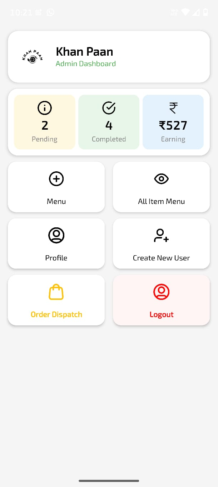
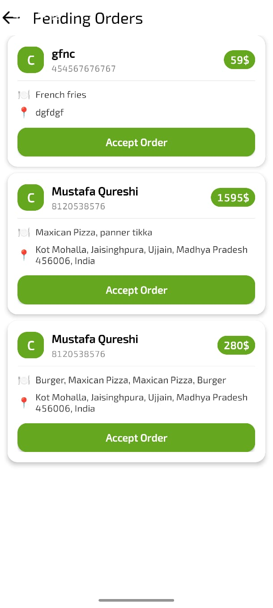
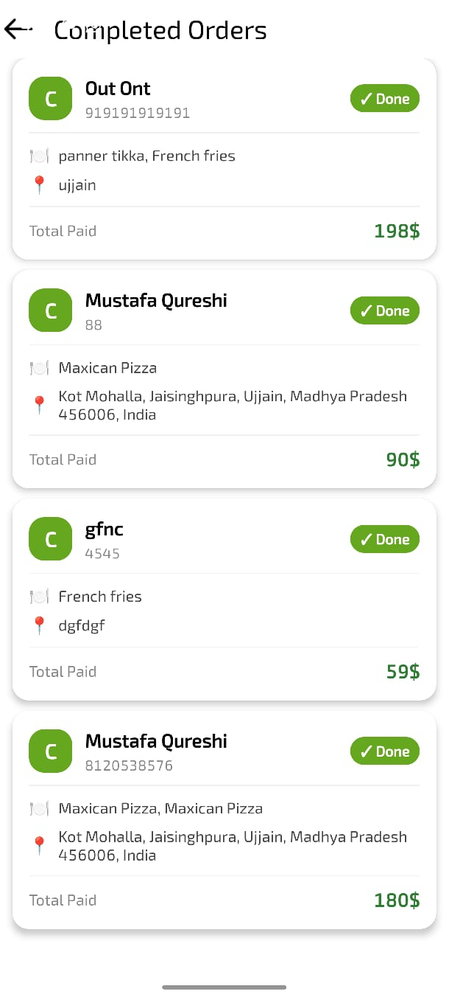
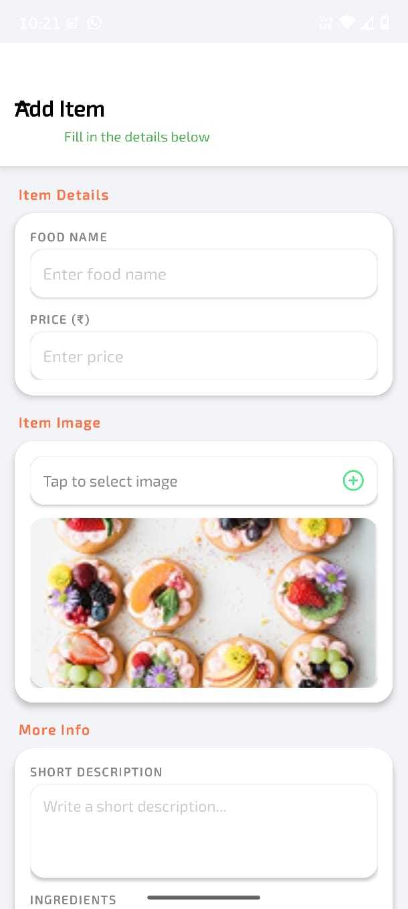
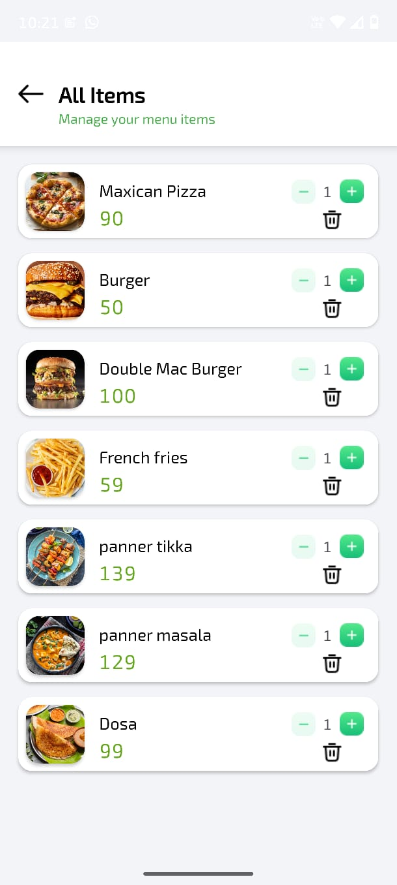

# 🛠️ Khan Paan — Admin Dashboard App

Khan Paan Admin is an Android application designed for restaurant administrators
to manage the complete food ordering workflow. It solves the problem of manual
order tracking by providing a real-time dashboard where admins can add and manage
menu items, view and accept incoming orders, track deliveries, mark payments as
received, and manage admin accounts — all from a single mobile interface connected
to a shared Supabase backend.

---

## 👥 Team Members

| Name               | Role                                                                         |
|--------------------|------------------------------------------------------------------------------|
| **Millind Amb**    | Backend developer, Database                                                  |
| **Prince Jaiswal** | Frontend developer,UI Figma ,Database Design, Documentation and artifacts    |
| **Mustafa qureshi** | Frontend developer                                                          |
| **Ritika Panwar**  | UI Sketches, Marketing                                                       |

---

## 🛠️ Tech Stack

| Category       | Technology                                      |
|----------------|-------------------------------------------------|
| Language       | Kotlin                                          |
| Framework      | Android SDK (min SDK 24, target SDK 36)         |
| Architecture   | Activity based                                  |
| Database       | Supabase (PostgreSQL)                           |
| Authentication | Firebase Authentication (Email + Google Sign-In)|
| Image Loading  | Glide 5.0.5                                     |
| Storage        | Supabase Storage (menu item images)             |
| Networking     | Supabase Kotlin SDK (BOM 3.1.4), Ktor Android   |
| Serialization  | Kotlin Serialization JSON 1.6.0                 |
| Build Tool     | Gradle (Kotlin DSL)                             |

---

## ⚙️ Setup and Run Instructions

### Prerequisites
- Android Studio Hedgehog or later
- JDK 11+
- Android SDK 36 installed (Tools → SDK Manager)
- The same Supabase project used for the User App
- The same Firebase project used for the User App

### Step 1 — Clone the repository
```bash
git clone https://github.com/Princejaiswalcode/AdminKhaanPaan
cd khan-paan-admin
```

### Step 2 — Configure Firebase
1. Use the same Firebase project as the user app
2. Download `google-services.json` for the admin app package
3. Place it in `app/` directory

### Step 3 — Configure Supabase
1. Open `app/src/main/java/com/example/adminAppKhanPaan/SupabaseClient.kt`
2. Replace placeholder values:
```kotlin
val client = createSupabaseClient(
    supabaseUrl = "YOUR_PROJECT_URL",   // same as user app
    supabaseKey = "YOUR_ANON_KEY"       // same as user app
) { ... }
```

### Step 4 — Create the admin-specific Supabase table
Run in your Supabase SQL Editor (other tables shared with user app):
```sql
-- Admin Users table
CREATE TABLE admin_users (
    id TEXT PRIMARY KEY,
    name TEXT, email TEXT, phone TEXT,
    address TEXT, restaurant_name TEXT,
    location TEXT, role TEXT DEFAULT 'admin',
    created_at TIMESTAMPTZ DEFAULT NOW()
);

ALTER TABLE admin_users ENABLE ROW LEVEL SECURITY;
CREATE POLICY "Allow all for admin_users"
ON admin_users FOR ALL TO anon
USING (true) WITH CHECK (true);
```

### Step 5 — Create a Storage bucket for menu images
1. Go to **Supabase Dashboard → Storage → New Bucket**
2. Name it `menu-images` and set it to **Public**
3. Run storage policies:
```sql
CREATE POLICY "Allow image uploads"
ON storage.objects FOR INSERT TO anon
WITH CHECK (bucket_id = 'menu-images');

CREATE POLICY "Allow image reads"
ON storage.objects FOR SELECT TO anon
USING (bucket_id = 'menu-images');
```

### Step 6 — First admin signup
1. Run the app and tap **Sign Up**
2. Fill in your name, restaurant name, email and password
3. This creates your Firebase Auth account and saves you to `admin_users` in Supabase
4. Future logins check `admin_users` — only registered admins can access the dashboard

### Step 7 — Build and run
1. Open project in Android Studio
2. Click **File → Sync Project with Gradle Files**
3. Select your device or emulator (API 24+)
4. Click ▶ **Run**

---

## 🎬 Demo Video
https://drive.google.com/file/d/15HM-6eeJe1r-eA3_u2_6Z645qiooT4gC/view?usp=drive_link
---

## 📸 Screenshots
### Admin Dashboard


### Pending Orders


### Completed Orders


### Add Menu Item


### All Menu Items

---

## ⚠️ Known Limitations & Future Work

### Current Limitations
- Admin verification is based on presence in `admin_users` table — no role hierarchy (super admin vs regular admin)
- No ability to edit or update existing menu items — only add or delete

### Future Work
- [ ] Role-based access control (super admin / manager / staff)
- [ ] Edit existing menu items
- [ ] Revenue analytics dashboard with charts
- [ ] Print receipt / invoice generation
- [ ] Low stock / inventory management alerts
